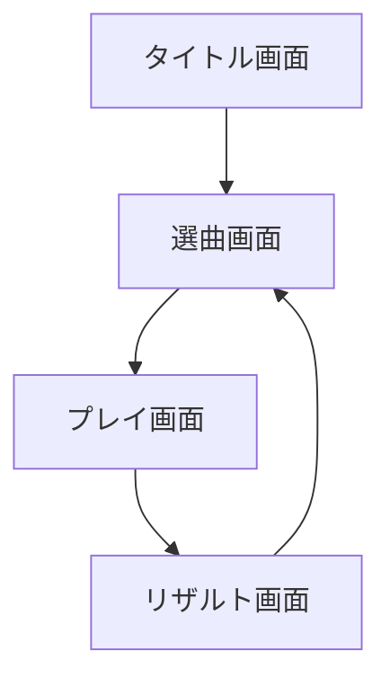
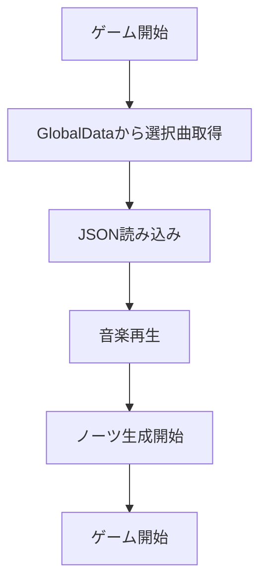
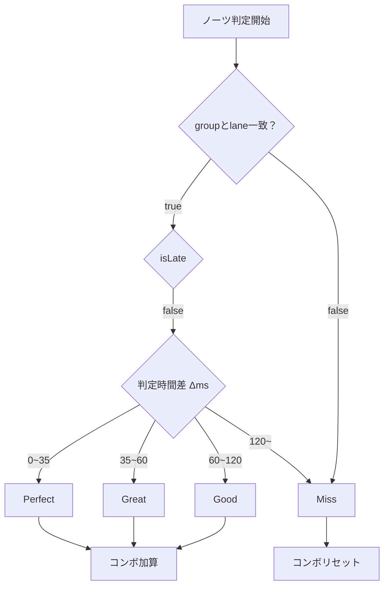
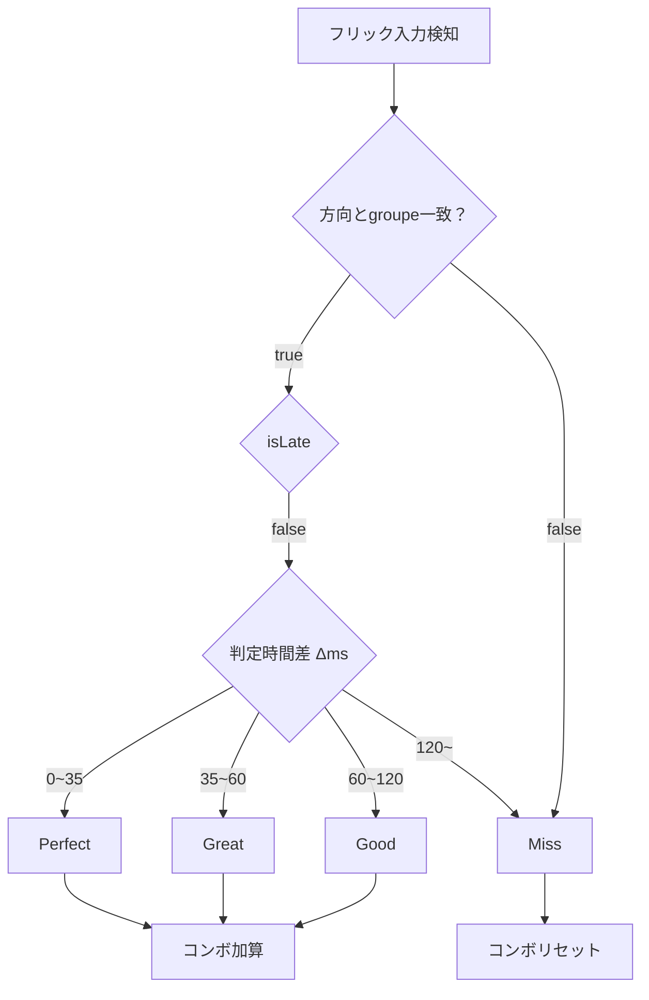
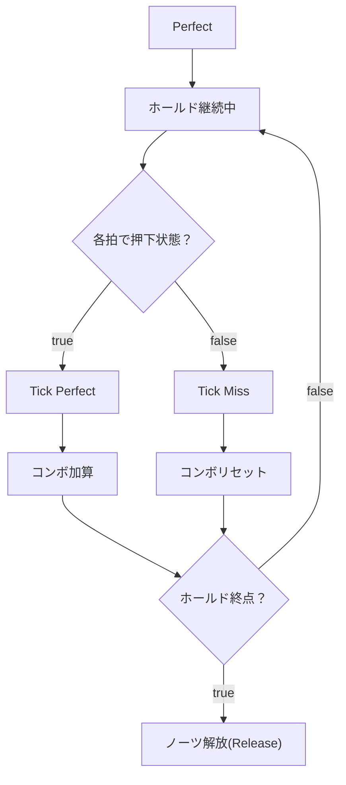

# TriVerse 設計書

## 1. システム概要（Overview）
TriVerse は、3レーン×3グループを制御するリズムゲームです。譜面 JSON（自前スキーマ）を読み取り、DSP 時間と BPM 変化に同期してノーツを生成・判定し、スコア／ランクを算出します。Dspを基準にノーツ生成、判定を行っているので動機ズレに強い設計です。ScriptableObject による選曲データベースとユーザ設定の一時保持を採用しています。

- **主要機能**
  - 譜面読み込み（JSON）と BPM 変化対応
  - オブジェクトプールによるノーツ生成（Tap / Hold / Flick 左右）
  - 早遅（Fast/Late）表示を含む判定（Perfect/Great/Good/Miss）
  - スコア計算とランク（D→SSS）
  - 選曲 UI（ScriptableObject DB）→ ゲーム → リザルトの遷移

---

## 2. ディレクトリ構成（抜粋）
```
TriVerseScripts/
├─ InRythmGame/
│  ├─ ChartReader.cs          # 譜面JSONの読み取り
│  ├─ GameManager.cs          # プレイ全体の初期化・進行
│  ├─ JudgeSystem.cs          # 判定・イベント実行の中核
│  ├─ MusicPlayer.cs          # 再生とDSP同期（薄いラッパ）
│  ├─ Notes/
│  │  ├─ Notes.cs             # ノーツ基底（MonoBehaviour）
│  │  ├─ TapNotes.cs / HoldNotes.cs / FlickNotes.cs
│  │  └─ NotesPool.cs         # Unity ObjectPool ラッパ
│  ├─ NotesGenerator.cs       # レーン単位の生成
│  ├─ NotesManager.cs         # 全レーン統括・プール初期化
│  ├─ ScoreManager.cs         # 判定カウントと最終スコア
│  ├─ Settings/GameSettings.cs# BPM・判定幅・DSP起点
│  └─ UIControllers/
│     ├─ JudgeRenderer.cs     # 判定アイコン＆早遅表示
│     ├─ ComboRenderer.cs     # コンボ表示
│     └─ TimingRenderer.cs    # Fast/Late テキスト等
│
├─ SelectMusic/
│  ├─ MusicDatabase.cs        # ScriptableObject DB（曲一覧）
│  ├─ MusicDataSO.cs          # 1曲のメタデータ（SO）
│  ├─ SelectMusicManager.cs   # 選曲画面統括
│  ├─ MusicButton.cs / JacketController.cs / StartButton.cs ほか
│  └─ SettingSet.cs / SliderChange.cs / SettingButton.cs
│
├─ Result/
│  ├─ ResultRenderer.cs       # 結果表示（スコア/判定内訳/ランク）
│  └─ BackButton.cs
│
├─ Types/
│  ├─ ChartTypes.cs           # 譜面/タイミング/BPM/ノーツ定義
│  ├─ Enums.cs                # JudgeType, RankType 等
│  └─ Types.cs                # ScoreData ほか構造体
│
├─ GlobalData.cs              # シーン間データの一時受け渡し
├─ SoundManager.cs            # 汎用SE/BGM 管理（タイトル等）
├─ FadeRenderer.cs            # 画面フェード
└─ TitleScreen.cs             # タイトル演出～遷移
```

---

## 3. 主要コンポーネント設計

### 3.1 GameManager（進行制御）
- 役割: プレイ開始時の初期化、`ChartReader`→`NotesManager`→`JudgeSystem`→`ScoreManager` の連携、曲開始/終了の制御。
- 主な処理:
  1. `GlobalData` から選曲/難易度/ユーザ設定を取得
  2. `ChartReader` で譜面JSONを読み込み `ChartRoot` を構築（`ChartTypes`）
  3. `GameSettings` に BPM ポイント、判定幅、速度倍率、DSP開始時刻を適用
  4. `NotesManager` でプールを初期化し、ノーツ生成をスケジューリング
  5. `MusicPlayer` を起動（DSP同期）
  6. Updateで `JudgeSystem.UpdateJudge()` をドライブし、終了条件でリザルトへ

### 3.2 ChartReader（譜面ロード）
- 役割: JSON→`ChartRoot` への逆シリアライズ。`Timing`（offsetMs / bpmPoints / resolution / endBeat）と `Chart`（lanes, notes[], events[]）を提供。
- 設計要点: BPM 可変に対応するため `GameSettings.SetBpmPoints()` に配列で設定。

### 3.3 NotesManager / NotesGenerator（生成）
- `NotesManager`
  - 役割: 全レーンの `NotesPool` を生成し、レーンごとに `NotesGenerator` を持たせてノーツ作成を委譲。
  - 保持: 各ノーツ種別（Tap/Hold/Flick左右）のプール、`SetNotesObjects()` で `JudgeSystem` に生成物を登録可能な辞書を引き渡し。
- `NotesGenerator`
  - 役割: `NotesManager`から呼び出されたときにそれに対応してノーツを生成。
  - 提供メソッド: `GenerateTapNotes / GenerateHoldNotes / GenerateLeftFlickNotes / GenerateRightFlickNotes`

### 3.4 Notes 系（表示・ライフサイクル）
- `Notes`（基底）: `NotesID`（一意ID）, `noteBeat`, `judgePosition`, `speedScale` を保持。`SetInfo()` / `SetGameSettings()` で初期化、画面外/判定完了でプールへ返却。
- 派生: `TapNotes` / `HoldNotes` / `FlickNotes` は見た目と更新ロジックを最小差分で実装。
- `NotesPool`: `UnityEngine.Pool.ObjectPool<T>` を用いたプール。`Release()` の二重呼び出し対策等を実装。

### 3.5 JudgeSystem（判定中核）
- 役割: 譜面イベント列のビルド、入力と現在時刻（DSP）からの最近傍イベント探索、判定（タップ/フリック/ホールド継続）、可視化およびノーツ解放。
- 判定ロジック: `ms = (nowSec - event.timeSec) * 1000 + userLatencyMs` を基準に `abs(ms)` と閾値（`perfectMS / greatMS / goodMS / missMS`）で確定。`ms<0` (判定ラインより上) かつ `abs>missMS` はスルー処理あり。
- 早遅（Fast/Late）: `ms` の符号で決定し、`TimingRenderer` に通知。
- 管理構造: `notesItems (List)`, `notesObjects (Dictionary<NotesID, Notes>)` によりロジックと GameObject を分離。完了時は `Release()` してプールへ返却。

### 3.6 ScoreManager（スコア・ランク）
- 役割: `AddPerfect/Great/Good/Miss` によりカウントを蓄積し、`calculateFinalScore()` で 0〜1000000 のスコア換算。`RankType`（D→SSS）を返す。
- 出力: `ScoreData { rank, score, combo, maxCombo, fast, late, perfects, greats, goods, misses }`。

### 3.7 UIControllers（表示）
- `JudgeRenderer` : 判定ごとのスプライト切替と `TimingRenderer` 連携（FAST/LATE表示）。
- `ComboRenderer` : 現在コンボを描画。
- `TimingRenderer`: 早遅テキストを描画。

### 3.8 選曲・結果・共通
- `SelectMusic` 系: `MusicDatabase (SO)` と `MusicDataSO` により曲メタを保持（id, タイトル, 難易度, ジャケット等）。`SelectMusicManager` が選択→`GlobalData`へ書き出し。
- `Result` 系: `ResultRenderer` が `GlobalData` から `ScoreData` を読み取り表示、戻るボタンで `SelectMusic` へ遷移。
- `GlobalData`: シーン間で 1プレイ分の結果・選曲情報・ユーザ設定（速度倍率など）を一時保持する単純なシングルトン。

---

## 4. データモデル（抜粋）
- `ChartTypes.cs`
  - `ChartRoot { int version; Timing timing; Chart chart; }`
  - `Timing { int offsetMs; int resolution; BpmPoint[] bpmPoints; int endBeat; }`
  - `Chart { string difficulty; int lanes; NotesItem[] notes; ChartEvent[] events; }`
  - `BpmPoint { double beat; double bpm; }`
  - `NotesItem { int lane; int group; double beat; NotesType type; double endBeat; int direction; }` など
- `Enums.cs`
  - `JudgeType { Perfect, Great, Good, Miss }`
  - `RankType { D, C, B, A, S, SS, SSS }`
- `Types.cs`
  - `ScoreData`, `JudgeScoreTable`, `MusicData` ほか

---

## 5. 時間同期と判定幅
- **時間基準**: `AudioSettings.dspTime` を `GameSettings.SetStartDspTime()` で原点化。拍→秒変換は BPM ポイント列から補間。
- **判定**: `perfectMS / greatMS / goodMS / missMS` を `GameSettings.SetUserSettings()` で設定可能。ユーザレイテンシ `userLatencyMs` を加味。
- **ホールド**: 押下開始タイミングの確定後、`KeepJudge` により一拍ごとで継続判定。終端 `endBeat` は判定対象外。
- **フリック**: `direction`（左/右）とその入力窓を `JudgeFlick` で評価。

---

## 6. フロー

### 6.1 画面遷移


### 6.2 ゲーム開始フロー


### 6.3 タップノーツ判定フロー

- プレイヤーの入力タイミングを基準に、ノーツ予定時刻との差を計算し、Δms の範囲によって判定ランクを決定する。判定に応じてスコア加算やコンボ更新を行う。

### 6.4 フリックノーツ判定フロー


### 6.4 ホールドノーツ継続判定フロー



---


## 7. 技術的工夫
- コードを管理しやすいように機能ごとに分離
- **ObjectPool** による GC 負荷低減とドロップ軽減
- **Dsp**ベースでの譜面と楽曲の**同期ズレ**対策
- ScriptableObjectで曲追加を**直感的**に
- GlobalDataによる**安全**な値渡し

---

## 8. 今後の展望
- Late/Fastの結果画面への表示
- 他難易度を実装
- 譜面エディタの追加
- ランキング機能の追加(主にバックエンド)
- 譜面を誰でも投稿できるように

---

### 変更履歴
- v0.1（2025-10-25） ChatGPTによる生成
- v0.2 (2025-10-25)　内容の確認修正

